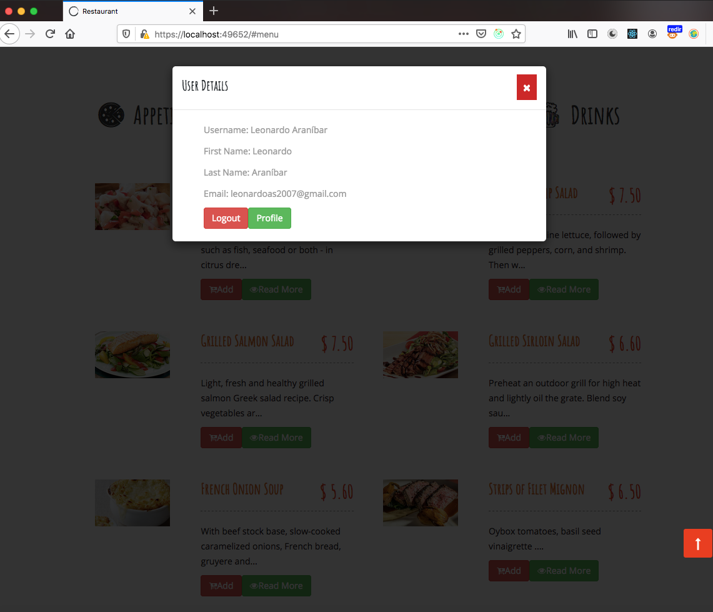

# React Redux Shopping Cart

React + Redux Thunk + Node-JS + MySQL

This project require another project as BackEnd [Server Nodejs](https://github.com/LeoCR/server-restaurant-client)

## User Interfaces

### View Appetizers

### View Main Courses

### View Desserts

### View Drinks

### Shopping Cart

### Add to Cart

### Login

### User Profile

This project was splitted in 2 more differents projects:

<ul>
    <li>[Checkout Restaurant](https://github.com/LeoCR/react-redux-checkout-restaurant)</li>
    <li>[Users Restaurant](https://github.com/LeoCR/react-redux-users-restaurant)</li>
</ul>

This project was bootstrapped with [Create React App](https://github.com/facebook/create-react-app).

In the project directory, you can run:

### `npm start`

Runs the app in the development mode. 
Open [http://localhost:3000](http://localhost:3000) to view it in the browser.

### `npm run build`

Builds the app for production to the `build` folder.<